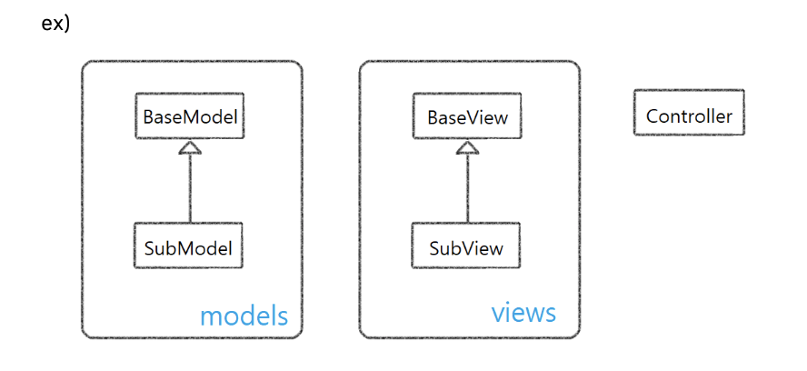

# 웹한글 개발 실기전형
## [지시 사항]

1. JavaScript로 작성하여 주시기 바랍니다.
2. 모든 문제는 탐색기에서 어느 경로에서나 Chrome 브라우저로 실행할 수 있도록 작성하여 주십시오.
3. 소스 파일은 source 폴더 아래에 위치하도록 하고, 사용하는 라이브러리 코드가 있다면 source 폴더와
별도로 lib 폴더에 위치하도록 구분하여 주십시오. 라이브러리 사용 여부는 평가에 반영되지 않습니다.
```
/source 
/lib
```
4. 구현 코드는 하나의 zip 파일(제출자이름(지원분야_신입/경력).zip)로 만들어 보내 주십시오. ex) 홍길동(웹한글_신입).zip
5. OOP 패턴으로 구현한다면 가산점이 있습니다. (ES5, ES6 모두 허용)
6. MVC 패턴을 적용한다면 가산점이 있습니다.
7. OOP와 MVC 패턴을 사용한 경우 클래스 다이어그램을 제출한다면 가산점이 있습니다. 라이브러리는 제외하고, 다음 그림과 같이 간략히 작성해서 제출해주세요. MVC 패턴을 적용한 경우 모델과 뷰를 구분해서 표시해주세요.


8. 결과물이 완성되지 않아도 제출해주시기 바랍니다.